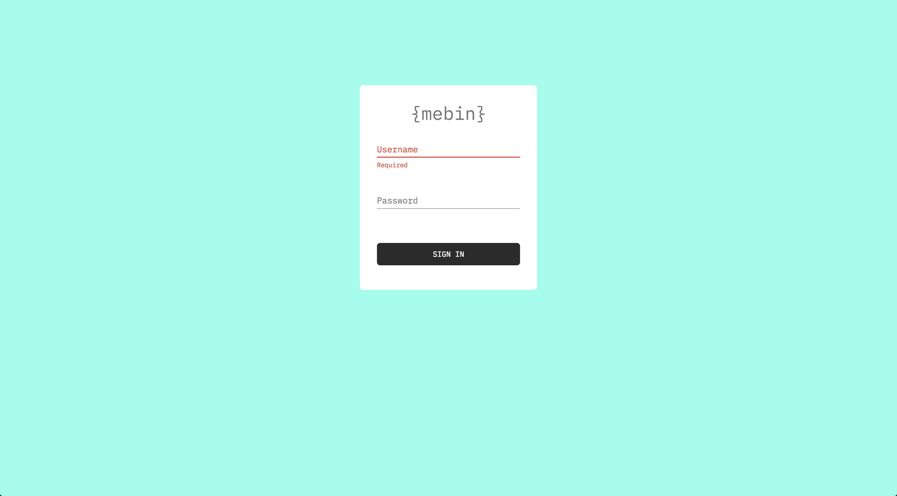
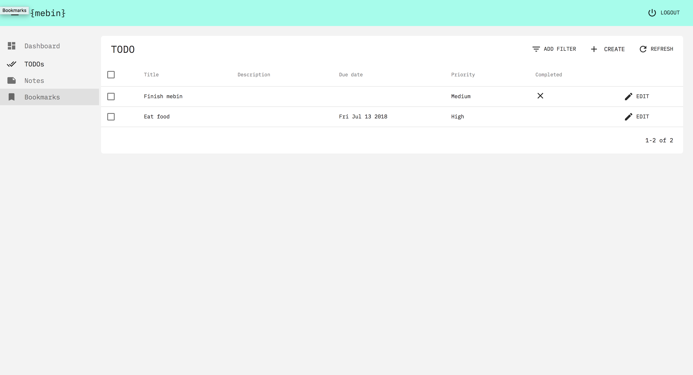

# {mebin}

> A personal information manager build with [react-admin](https://marmelab.com/react-admin/) & [Firebase](https://firebase.google.com/)

## About

Simple personal information management system. Heavily based on [React-admin Demo](https://github.com/marmelab/react-admin/tree/master/examples/demo). Build using [create-react-app](https://github.com/facebook/create-react-app).

## Setup

```sh
$ git clone https://github.com/tiaanduplessis/mebin.git
$ cd mebin && yarn
```

Update `src/config/firebase.js` with your firebase config (Remember to create user with a profile in realtime DB).

```sh
$ yarn start
```

## Demo

Go to [login page](http://mebin-f5600.firebaseapp.com/) and use username `demo@user.com` and password `123456`.

## Screenshots

<div align="center">
  
</div>

<div align="center">
  
</div>

## LICENSE

MIT